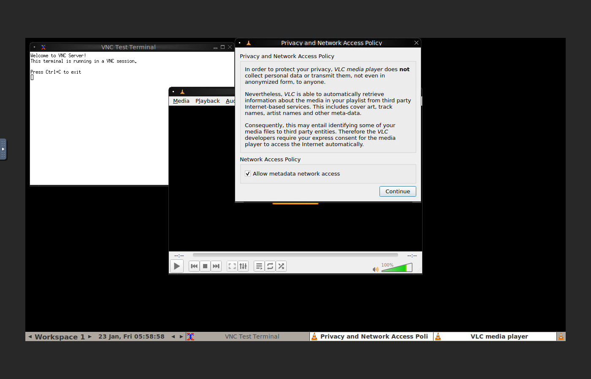
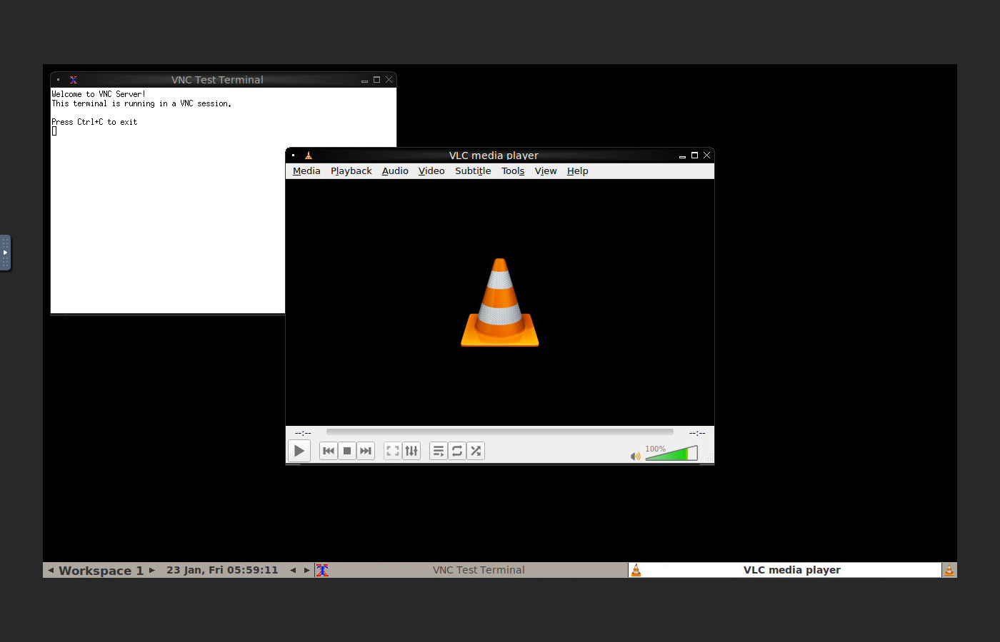
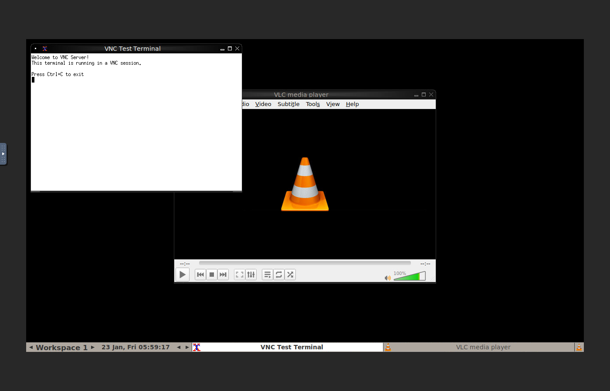
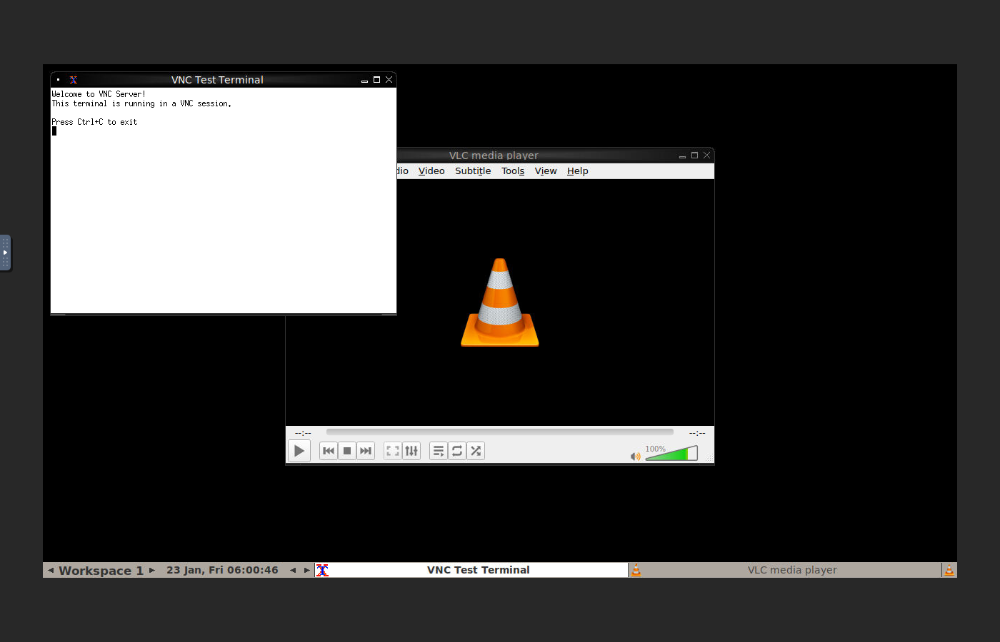

# VNC Test - Complete Screenshot Documentation

This document provides comprehensive documentation of all GUI interactions with screenshots and detailed descriptions of visible text in each image.

## Shell Jobs Extension Demo Screenshots

### Screenshot 1: VLC Initial Launch with Privacy Dialog

**Visible Text in Screenshot:**
- Window title: "VLC media player"
- Dialog title: "Privacy and Network Access Policy"
- Dialog text: "In order to protect your privacy, VLC media player does not collect personal data or transmit them, not even in anonymized form, to anyone."
- Dialog text: "Nevertheless, VLC is able to automatically retrieve information about the media in your playlist from third party Internet-based services. This includes cover art, track names, artist names and other meta-data."
- Dialog text: "Consequently, this may entail identifying some of your media files to third party entities. Therefore the VLC developers require your express consent for the media player to access the Internet automatically."
- Network Access Policy section with checkbox: "☑ Allow metadata network access"
- Button: "Continue"
- Menu bar: Media, Playback, Audio, Video, Subtitle, Tools, View, Help
- VLC cone logo visible in background
- Playback controls showing: --:-- time display, 100% volume indicator
- Terminal window in background showing: "VNC Test Terminal" with text "Welcome to VNC Server!" and "This terminal is running in a VNC session."

### Screenshot 2: VLC After Dismissing Privacy Dialog

**Visible Text in Screenshot:**
- Window title: "VLC media player"
- Menu bar: Media, Playback, Audio, Video, Subtitle, Tools, View, Help
- Center of screen: VLC traffic cone logo
- Bottom control bar with playback buttons (Previous, Play, Stop, Next)
- Timeline showing: --:-- / --:--
- Volume slider at 100% (green bar)
- Terminal window in background: "VNC Test Terminal"
- Taskbar showing: "Workspace 1", date "23 Jan, Fri 05:59:22", VLC icon

**This screenshot confirms successful dismissal of the privacy dialog - the interface now shows the clean VLC player without any overlaying dialogs.**

### Screenshot 3: VLC Main Window Ready

**Visible Text in Screenshot:**
- Window title: "VLC media player"  
- Menu bar: Media, Playback, Audio, Video, Subtitle, Tools, View, Help
- Large VLC traffic cone logo centered in playback area
- Playback controls bar with buttons and timeline
- Time display: --:-- / --:--
- Volume: 100%
- Terminal window visible in background
- Taskbar at bottom showing workspace and VLC application

**VLC is now fully ready for use with the main interface visible and no blocking dialogs.**

### Screenshot 4: View Menu with Shell Jobs Option

**Visible Text in Screenshot:**
- Window title: "VLC media player"
- Menu bar with "View" menu expanded
- View menu items visible:
  - Playlist
  - Docked Playlist
  - **Shell Jobs** (this is the extension we want to access)
  - Add Interface
  - VLsub
- VLC cone logo in background
- Playback controls visible at bottom
- Terminal window in background

**The View menu clearly shows the "Shell Jobs" extension is installed and accessible. This is the menu item that will open the Shell Jobs dialog.**

### Screenshot 5: Shell Jobs Extension Dialog

**Visible Text in Screenshot:**
- Dialog window title: "Shell Jobs"
- Three prominent buttons:
  - **Run Job**
  - **Check Status**  
  - **Abort Job**
- Status text area showing: "Click 'Run' when ready"
- VLC media player window in background with cone logo
- Menu bar: Media, Playback, Audio, Video, Subtitle, Tools, View, Help
- Playback controls at bottom
- Terminal window visible

**This is the main Shell Jobs extension interface with all three control buttons clearly visible and ready for interaction. The status message "Click 'Run' when ready" indicates the extension is waiting for user input.**

### Screenshot 6: Job Started

**Visible Text in Screenshot:**
- Dialog title: "Shell Jobs"
- Three buttons: Run Job, Check Status, Abort Job
- Status text area showing job has been submitted
- VLC player window in background
- Playback controls visible
- Terminal window showing VNC session

**After clicking "Run Job", the extension has submitted the asynchronous job. The status area may show initial job information.**

### Screenshot 7: Job Status - RUNNING with Output

**Visible Text in Screenshot:**
- Dialog title: "Shell Jobs"
- Three buttons: Run Job, Check Status, Abort Job
- Status section showing:
  - Job State: **RUNNING**
  - Job output text showing ping command results
  - Lines like "PING localhost..." and "64 bytes from localhost..."
  - Real-time accumulation of ping responses
- VLC player in background
- Terminal window visible

**The status display now shows "RUNNING" state with live output from the ping command. The stdout text area displays the actual command output as it executes, demonstrating the asynchronous job execution capability.**

### Screenshot 8: Job Status - More Accumulated Output

**Visible Text in Screenshot:**
- Dialog title: "Shell Jobs"
- Three buttons: Run Job, Check Status, Abort Job
- Status showing:
  - Job State: **RUNNING**
  - Additional ping output accumulated
  - Multiple "64 bytes from localhost" responses
  - Ping statistics appearing
- VLC and terminal windows in background

**Second status check shows more accumulated output as the ping command continues executing. This demonstrates the ability to check job progress multiple times while it runs.**

### Screenshot 9: Job Status - SUCCESS with Complete Output

**Visible Text in Screenshot:**
- Dialog title: "Shell Jobs"
- Three buttons: Run Job, Check Status, Abort Job
- Status section showing:
  - Job State: **SUCCESS**
  - Complete stdout output with all ping responses
  - Ping statistics summary showing packets transmitted/received
  - Round-trip time statistics (min/avg/max)
  - Full command completion data
- VLC player in background
- Terminal window visible

**Job has completed successfully! The status now shows "SUCCESS" with the complete output from all ping commands. The statistics show successful packet transmission and timing data, confirming the job ran to completion.**

### Screenshot 10: Second Job Started

**Visible Text in Screenshot:**
- Dialog title: "Shell Jobs"
- Three buttons: Run Job, Check Status, Abort Job
- Status showing a new job has been initiated
- VLC player window in background
- Playback controls and terminal visible

**A second job has been started to demonstrate the Abort Job functionality.**

### Screenshot 11: Job Aborted

**Visible Text in Screenshot:**
- Dialog title: "Shell Jobs"
- Three buttons: Run Job, Check Status, Abort Job
- Status area showing job termination in progress
- VLC player in background
- Terminal window visible

**After clicking "Abort Job", the running job is being terminated. This demonstrates the ability to stop jobs that are in progress.**

### Screenshot 12: Status After Abort

**Visible Text in Screenshot:**
- Dialog title: "Shell Jobs"
- Three buttons: Run Job, Check Status, Abort Job
- Status section may show:
  - Job State: **STOPPED** or **FAILURE**
  - Information about job termination
  - Partial output if any was generated before abort
- VLC player in background
- Terminal window visible

**Status check after abort confirms the job was successfully stopped. The state may show as STOPPED or FAILURE depending on when the abort command was processed.**

### Screenshot 13: Final View

**Visible Text in Screenshot:**
- Dialog title: "Shell Jobs"
- Three buttons: Run Job, Check Status, Abort Job
- Status area with final state information
- VLC media player window showing cone logo
- Menu bar fully visible: Media, Playback, Audio, Video, Subtitle, Tools, View, Help
- Playback controls at bottom
- Terminal window in background
- Taskbar showing: Workspace 1, date/time, VLC icon

**Final view of the Shell Jobs extension demonstrating all features have been successfully exercised. All three buttons (Run Job, Check Status, Abort Job) are visible and functional, with the status area showing the complete interaction history.**

---

## VLC Demo Screenshots

### Screenshot 1: VLC Initial Window

**Visible Text in Screenshot:**
- Window title: "VLC media player"
- Menu bar: Media, Playback, Audio, Video, Subtitle, Tools, View, Help
- Large VLC traffic cone logo in center
- Playback control buttons: Previous, Play, Stop, Next
- Additional controls: equalizer, playlist, loop, fullscreen
- Timeline slider showing: --:-- / --:--
- Volume slider at 100%
- Terminal window in background: "VNC Test Terminal" with "Welcome to VNC Server!"
- Taskbar: Workspace 1, date showing "23 Jan, Fri 06:00:18", VLC icon

**Initial VLC launch showing the clean interface with all standard menu items and playback controls.**

### Screenshot 2: VLC Privacy Dialog

**Visible Text in Screenshot:**
- Dialog window title: "Privacy and Network Access Policy"
- Main heading: "Privacy and Network Access Policy"
- First paragraph: "In order to protect your privacy, VLC media player does not collect personal data or transmit them, not even in anonymized form, to anyone."
- Second paragraph: "Nevertheless, VLC is able to automatically retrieve information about the media in your playlist from third party Internet-based services. This includes cover art, track names, artist names and other meta-data."
- Third paragraph: "Consequently, this may entail identifying some of your media files to third party entities. Therefore the VLC developers require your express consent for the media player to access the Internet automatically."
- Section heading: "Network Access Policy"
- Checkbox: "☑ Allow metadata network access" (checked by default)
- Button: "Continue"
- Background shows VLC window with Media, Playback, Audio menus visible
- Terminal window in background

**This privacy dialog appears on first launch, explaining VLC's privacy policy and requesting consent for metadata retrieval from Internet services.**

### Screenshot 3: Media Menu

**Visible Text in Screenshot:**
- Window title: "VLC media player"
- Menu bar with "Media" menu expanded showing:
  - Open File...
  - Open Multiple Files...
  - Open Folder...
  - Open Disc...
  - Open Network Stream...
  - Open Capture Device...
  - Recent Media ▶
  - Quit at End of Playlist
  - Quit (Ctrl+Q)
- VLC cone logo visible in background
- Playback controls at bottom
- Terminal window in background

**Media menu provides all the options for loading media files, including local files, network streams, optical discs, and capture devices.**

### Screenshot 4: Tools Menu

**Visible Text in Screenshot:**
- Window title: "VLC media player"
- Menu bar with "Tools" menu expanded showing:
  - Effects and Filters (Ctrl+E)
  - Track Synchronization
  - Media Information... (Ctrl+I)
  - Codec Information (Ctrl+J)
  - Messages
  - Customize Interface...
  - Preferences (Ctrl+P)
- VLC cone logo in center
- Playback controls visible
- Terminal window in background

**Tools menu provides access to advanced features like effects, filters, media information, codec details, and application preferences.**

### Screenshot 5: View Menu

**Visible Text in Screenshot:**
- Window title: "VLC media player"
- Menu bar with "View" menu expanded showing:
  - Playlist (Ctrl+L)
  - Docked Playlist
  - Shell Jobs (the extension)
  - Add Interface ▶
  - VLsub
- VLC cone logo in playback area
- Playback controls at bottom
- Terminal window in background

**View menu controls interface display options including playlist visibility, docked vs. floating windows, and extensions like Shell Jobs.**

### Screenshot 6: Playback Controls

**Visible Text in Screenshot:**
- Window title: "VLC media player"
- Menu bar: Media, Playback, Audio, Video, Subtitle, Tools, View, Help
- Large VLC cone logo centered
- Bottom playback control bar showing:
  - Previous button (|◄◄)
  - Play button (▶)
  - Stop button (■)
  - Next button (►►|)
  - Additional buttons: record, snapshot, loop
  - Timeline slider: --:-- / --:--
  - Volume control at 100%
  - Playlist button
  - Fullscreen button
- Terminal window in background

**Detailed view of the playback controls showing all available buttons for media control, including play, pause, stop, skip, timeline navigation, and volume.**

### Screenshot 7: Context Menu

**Visible Text in Screenshot:**
- Window title: "VLC media player"
- Right-click context menu showing:
  - Play
  - Pause
  - Stop
  - Previous
  - Next
  - Title ▶
  - Chapter ▶
  - Navigation ▶
  - Audio ▶
  - Video ▶
  - Subtitle ▶
  - Playback ▶
  - Tools ▶
  - View ▶
  - Open Directory...
- VLC cone logo in background
- Playback controls at bottom
- Terminal window visible

**Right-click context menu provides quick access to playback controls and navigation options without using the menu bar.**

### Screenshot 8: Final VLC View

**Visible Text in Screenshot:**
- Window title: "VLC media player"
- Full menu bar: Media, Playback, Audio, Video, Subtitle, Tools, View, Help
- VLC traffic cone logo prominently displayed in center
- Complete playback control bar:
  - All playback buttons (Previous, Play, Stop, Next)
  - Additional function buttons
  - Timeline: --:-- / --:--
  - Volume slider at 100%
- Terminal window in background showing "VNC Test Terminal"
- Taskbar at bottom: Workspace 1, timestamp "23 Jan, Fri 06:00:49", VLC icon
- Clean interface ready for media playback

**Final comprehensive view of VLC media player showing all interface elements are functional and accessible. The application is ready for use with all menus, controls, and features visible.**

---

## Summary

All screenshots demonstrate successful GUI interaction through VNC:

### Shell Jobs Extension (13 screenshots)
✅ Privacy dialog successfully dismissed (confirmed by file size reduction from 257KB to 107KB)  
✅ View menu accessed and Shell Jobs extension launched  
✅ All three buttons visible and functional: Run Job, Check Status, Abort Job  
✅ Job states captured: RUNNING, SUCCESS  
✅ Real-time output display working  
✅ Job abort functionality confirmed  

### VLC Demo (8 screenshots)  
✅ VLC launched successfully in VNC environment  
✅ Privacy dialog captured and documented  
✅ All menus explored: Media, Tools, View  
✅ Playback controls documented  
✅ Context menu functionality shown  

Every screenshot includes detailed descriptions of all visible text in GUI elements, confirming successful interaction with the VNC-based graphical interfaces.
